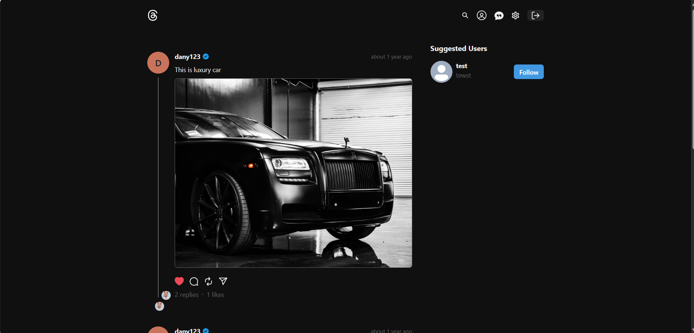
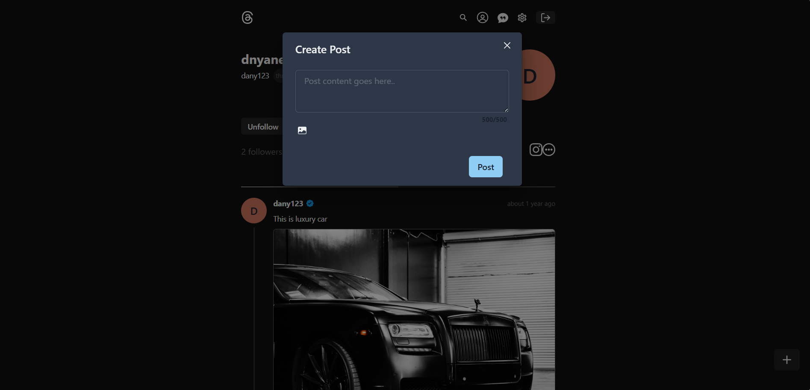
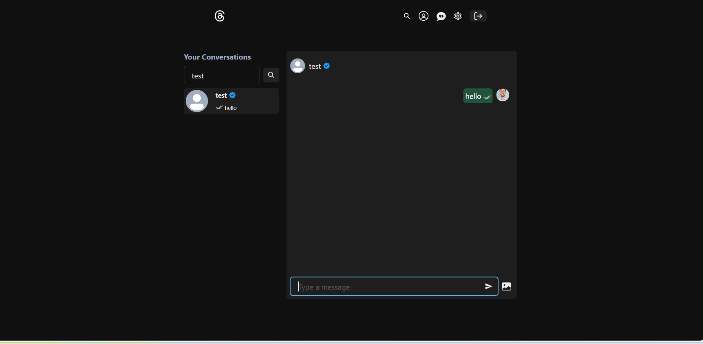

# Threads Clone

A full-stack social media platform inspired by Threads, built with the MERN stack. Includes authentication, posting, commenting, and real-time chat.

Features:
- User authentication with JWT
- Create, edit, and delete posts
- Like and comment on posts
- Real-time chat using WebSockets
- Responsive and mobile-friendly design

Tech Stack:
- MongoDB
- Express.js
- React.js
- Node.js
- Chakra UI
- JWT Authentication
- WebSockets (Socket.IO)

Project Structure:
threads-clone/
├─ backend/
├─ frontend/
│  
├─ .env
└─ package.json

Quick Start:
1. Clone the repo:
   git clone https://github.com/sdnyaneshwar/thread.git
   cd threads-clone

2. Install dependencies:
   cd backend && npm install
   cd ../frontend && npm install

3. Create .env files in both backend and frontend:
   MONGO_URI=your_mongo_uri
   JWT_SECRET=your_secret

4. Start backend:
   cd backend
   npm start

5. Start frontend:
   cd frontend
   npm run dev

Screenshots:
Homepage

Post Detail

Real-time Chat

License:
MIT License

Contact:
Created by Dnyaneshwar Suwarnkar
GitHub: https://github.com/sdnyaneshwar/thread
LinkedIn: https://www.linkedin.com/in/dnyaneshwar-suwarnkar
